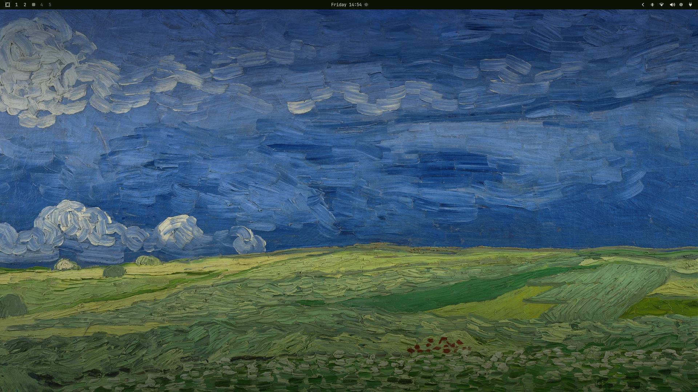
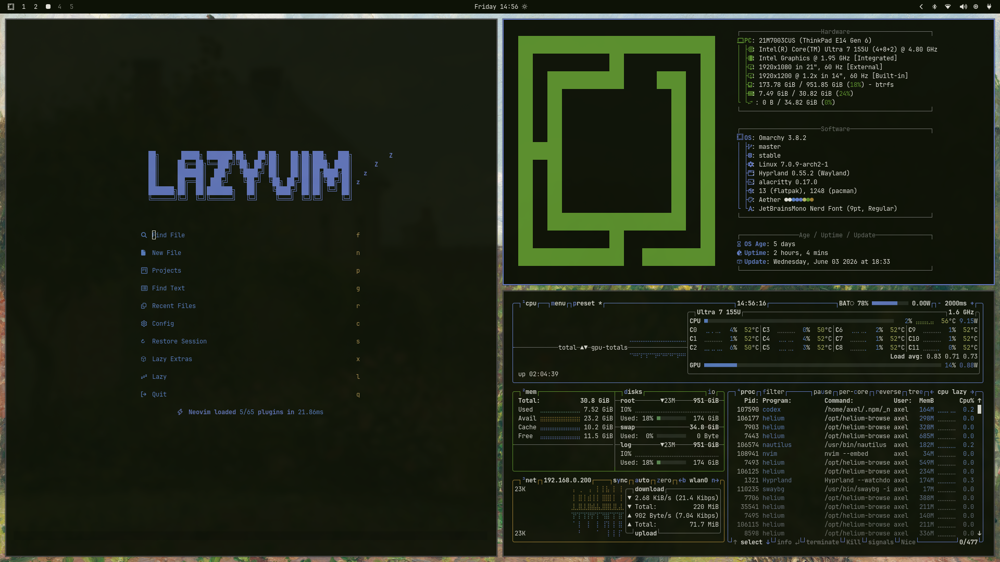
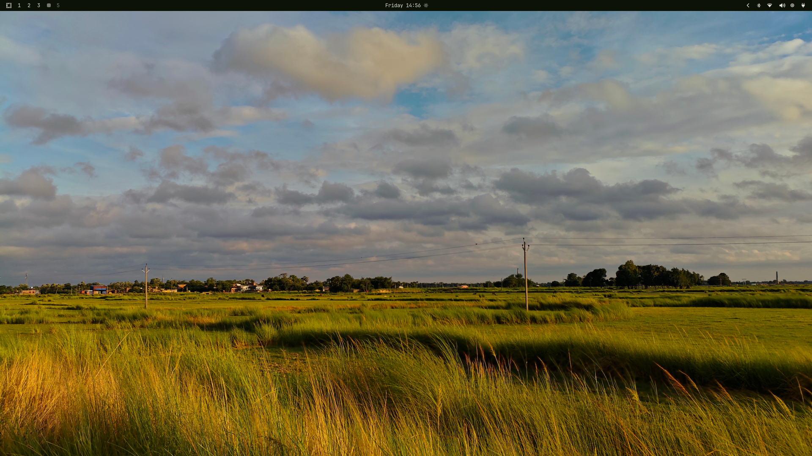

# Omarchy Nature Dark Theme

A dark green nature-inspired Omarchy theme with muted foliage backgrounds, soft off-white text, and cool blue accents. It includes matching colors for Hyprland, terminals, Waybar, Walker/Wofi, Mako, GTK, editors, and several common desktop tools.

## Screenshots







## Install

Install and apply the theme with Omarchy:

```bash
omarchy theme install git@github.com:JafarShamzsi/omarchy-nature-dark-theme.git
```

Omarchy derives the theme name from the repository name, so this installs as:

```bash
omarchy theme set nature-dark
```

If you prefer HTTPS:

```bash
omarchy theme install https://github.com/JafarShamzsi/omarchy-nature-dark-theme.git
```

## Update

```bash
omarchy theme update
```

## Included

- Hyprland and Hyprlock colors
- Waybar, Walker, Wofi, Mako, SwayOSD, and GTK styling
- Alacritty, Kitty, Ghostty, Foot, Warp, Btop, Zellij, and Neovim colors
- VS Code, Zed, Vencord, and Chromium theme files
- Multiple wallpapers in `backgrounds/`

## Palette

| Role | Color |
| --- | --- |
| Background | `#0D1206` |
| Foreground | `#E1E0D9` |
| Accent | `#6378c1` |
| Green | `#5b8f2c` |
| Yellow | `#b7b966` |
| Cyan | `#5a80c5` |

## Backgrounds

Cycle through the included wallpapers with:

```bash
omarchy theme bg next
```

Or set a specific image:

```bash
omarchy theme bg set ~/.config/omarchy/themes/nature-dark/backgrounds/<image-file>
```
